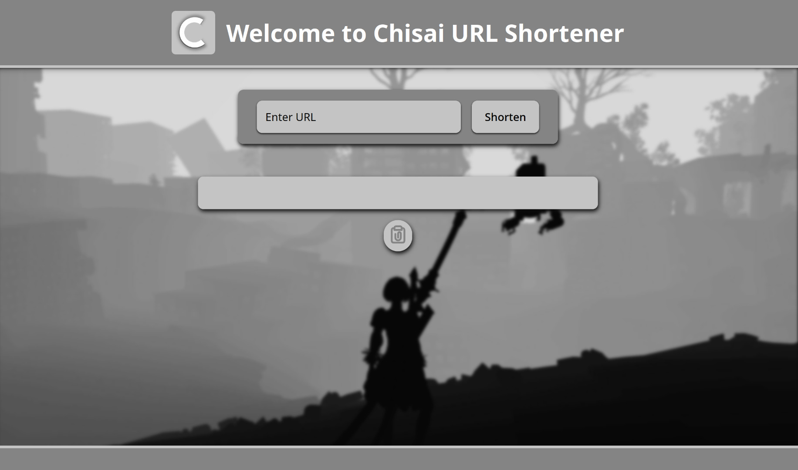

# Chisai URL 

A distributed, high-performance URL shortener built with Node.js, Express, Redis, and MongoDB. It is designed for scalability and high-throughput.

## Core Architecture

- **Node.js/Express:** Serves a simple REST API for shortening and redirecting URLs.
- **Redis:** Used as a high-speed caching layer. It stores recently created or accessed URLs for fast lookups, reducing database load.
- **MongoDB:** The primary database for persistently storing all URL mappings.
- **Stateless API:** The application is stateless, allowing for easy horizontal scaling by running multiple instances behind a load balancer.
- **Monitoring:** Exposes application metrics via Prometheus endpoints for observability.
- **Distributed Lock:** Implements a distributed lock using Redis to prevent race conditions when multiple requests to shorten the same URL are received simultaneously. This ensures data consistency and prevents duplicate entries.


## Setup and Running

-  **Start All Services:**
    This command will start Redis, MongoDB, App and the monitoring services.
    ```bash
    git clone https://github.com/SamTheTechi/ChisaiURL.git
    ```
    ```bash
    cd ./ChisaiURL
    ```
    ```bash
    bun install # or npm install
    ```
    ```bash
    docker-compose up -d
    ```
- Then Visit `http://localhost:5000`


## Performance Stats


## API Endpoints

- `POST /chisai`
  - Shortens a new URL.
  - **Body:** `{ "originalUrl": "https://your-long-url.com" }`
  - **Success Response:** `{ "url": "7charID", "msg": "..." }`

- `GET /{short}`
  - Redirects to the original URL corresponding to the `short` ID.

- `GET /api/metrics`
  - Exposes application metrics in a format that can be scraped by Prometheus.

## License

This project is licensed under the **MIT License**. See the [LICENSE](LICENSE) file for details.

---

Made with ❤️ by [Sameer Gupta](https://github.com/SamTheTechi)

